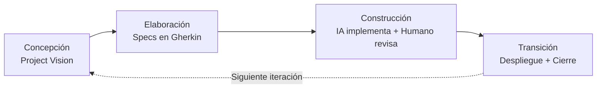

# HIM — Human-In-the-loop Methodology

**HIM** es una metodología de desarrollo de software que integra RUP (4 fases), Spec-Driven Development (Gherkin) e implementación asistida por IA, con el humano siempre en control.

Creada por Henry Gomez (Lerna Group) en julio 2026.

---

## Filosofía central

> El humano define el qué y el porqué. La IA ejecuta el cómo dentro de esos límites. El humano revisa, ajusta y decide.

No es delegación completa a la IA. Es **aumentación controlada**.

---

## Estructura del repositorio

```
him-metodologia/
├── README.md                   ← Estás aquí
├── GUIA-RAPIDA.md              ← Cheat sheet de 1 página
├── fundamentos/
│   └── definicion.md           ← Fundación completa de HIM
├── templates/
│   ├── spec-him.md             ← Template del spec (artefacto central)
│   ├── project-vision.md       ← Template de visión del proyecto
│   ├── cierre-iteracion.md     ← Template de retrospectiva
│   └── adr.md                  ← Template de decisiones arquitectónicas
├── guias/
│   ├── modo-lite.md            ← Adaptación para proyectos pequeños
│   ├── gestion-de-cambios.md   ← Cómo manejar cambios y rechazos
│   ├── sistema-validacion.md   ← Reglas de validación de specs
│   └── estimacion.md           ← Sistema de estimación por puntos
├── ejemplos/
│   └── docker-log-cleaner.md   ← Spec completo de ejemplo
└── diseno/
    └── generador-web.md        ← Diseño de la herramienta generadora de specs
```

---

## Cómo usar HIM

### Si empiezas un proyecto nuevo

1. Lee `GUIA-RAPIDA.md` para tener el panorama general
2. Lee `fundamentos/definicion.md` para entender la metodología a fondo
3. Usa `templates/` para crear los artefactos de cada fase
4. Apóyate en `guias/` según lo que necesites (Modo Lite para scripts, validación para specs, etc.)

### Flujo rápido



Cada fase tiene un **gate** (hito formal) que debe cumplirse para pasar a la siguiente.

---

## Las 3 patas de HIM

| Pilar | Qué aporta |
|-------|-----------|
| **RUP (4 fases)** | Estructura de proceso, hitos, disciplinas paralelas, gestión de riesgos |
| **Spec-Driven (Gherkin)** | Casos de uso como contrato ejecutable, sin ambigüedad, consumibles por IA |
| **IA como implementadora** | Ejecución del spec bajo supervisión humana |

---

## Roles

| Rol | Responsabilidad | Quién lo ejerce |
|-----|----------------|-----------------|
| **Especificador** | Define los specs en Gherkin, criterios de aceptación, alcance | Humano |
| **Ejecutor** | Implementa los specs dentro de los límites definidos | IA |
| **Validador** | Revisa la implementación, decide si cumple el spec | Humano |
| **Arquitecto** | Define decisiones técnicas, estructura del sistema, estándares | Humano + IA |

---

## Licencia

Uso interno Lerna Group.
