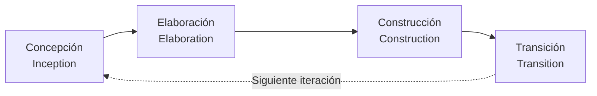
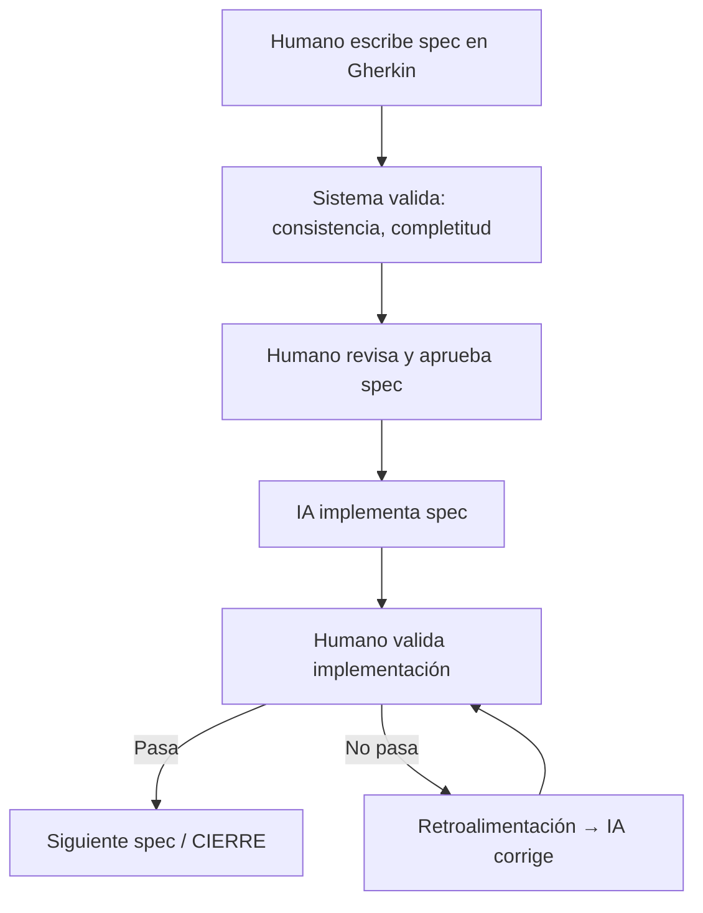

# HIM — Human-In-the-loop Methodology

> Metodología de desarrollo de software que integra RUP (4 fases), Spec-Driven Development (Gherkin) e implementación asistida por IA, con el humano siempre en control.

---

## 1. Origen

Creada por Henry Gomez (Lerna Group) en julio 2026.

### Problema que resuelve

- Las metodologías ágiles son flexibles pero ambiguas para la implementación por IA
- RUP clásico es pesado y su documentación extensa mata proyectos pequeños/medianos
- La tendencia de "delegación completa a la IA" elimina el control humano, generando código inconsistente y deuda técnica acelerada
- El software de gestión de proyectos existente fuerza al usuario a adaptarse a lo que ofrecen

### Filosofía central

> El humano define el qué y el porqué (specs, casos de uso, criterios de aceptación). La IA ejecuta el cómo dentro de esos límites. El humano revisa, ajusta y decide.

---

## 2. Las 3 patas

| Pilar | Qué aporta |
|-------|-----------|
| **RUP (4 fases)** | Estructura de proceso: fases, hitos, disciplinas paralelas, gestión de riesgos |
| **Spec-Driven (Gherkin)** | Casos de uso como contrato ejecutable, sin ambigüedad, consumibles por IA |
| **IA como implementadora** | Ejecución del spec dentro de los límites definidos, bajo supervisión humana |

---

## 3. Las 4 fases

Cada fase produce artefactos concretos. Cada fase tiene un **gate** (hito formal) que debe cumplirse para avanzar.

### Fase 1: Concepción

**Objetivo:** Entender el problema, definir alcance, identificar riesgos, alinear lenguaje.
**Hito:** Lifecycle Objectives — alcance validado, riesgos identificados.

| Artefacto | Formato | Descripción |
|-----------|---------|-------------|
| **Project Vision** | Markdown (1 pág) | Qué se construye, para quién, por qué. Ver `templates/project-vision.md`. |
| **User Types** | Lista | Roles de usuario del sistema. |
| **Feature Map** | Gherkin resumido | Features priorizadas con 1-2 escenarios c/u. |
| **Risk List** | Tabla | Riesgos con severidad y plan de mitigación. |
| **Glosario** | Lista | Términos del dominio para alinear lenguaje humano+IA. |

**Gate:** Project Vision aprobada. Feature Map cubre el mínimo viable. Riesgos con plan de mitigación.

### Fase 2: Elaboración

**Objetivo:** Refinar specs, diseñar arquitectura, mitigar riesgos principales.
**Hito:** Lifecycle Architecture — arquitectura validada, specs listos para construir.

| Artefacto | Formato | Descripción |
|-----------|---------|-------------|
| **Specs detallados** | Gherkin + metadata | Artefacto central. 5+ escenarios por feature. Ver `templates/spec-him.md`. |
| **ADRs** | Markdown | Decisiones arquitectónicas. Ver `templates/adr.md`. |
| **Mapa de dependencias** | Diagrama/lista | Orden de implementación y camino crítico. |
| **Prototipo visual** | Wireframes | Si aplica (proyectos con UI). |

**Gate:** Todos los specs pasaron validación. ADRs cubren decisiones críticas. Prototipo validado si aplica.

### Fase 3: Construcción

**Objetivo:** Implementar cada spec con IA, revisión humana, iterar hasta cumplir.
**Hito:** Initial Operational Capability — funcionalidad completa y aprobada.

| Artefacto | Formato | Descripción |
|-----------|---------|-------------|
| **Código** | Lenguaje del proyecto | Generado por IA desde los specs. |
| **Tests** | Framework del proyecto | Derivados de los escenarios Gherkin. |
| **Review Records** | Markdown | Qué se revisó, aprobó, corrigió. |

**Gate:** Todos los specs implementados pasan sus tests. Review humano positivo.

### Fase 4: Transición

**Objetivo:** Desplegar, documentar, cerrar iteración.
**Hito:** Product Release — producto en producción.

| Artefacto | Formato | Descripción |
|-----------|---------|-------------|
| **Release Notes** | Markdown | Qué incluye esta release. |
| **Guía de operación** | Markdown | Despliegue, monitoreo, backup. |
| **Cierre de iteración** | Markdown | Retrospectiva. Ver `templates/cierre-iteracion.md`. |

**Gate:** Release operativa. Guía validada. Cierre documentado.

---

## 4. Roles

| Rol | Responsabilidad | Quién lo ejerce |
|-----|----------------|-----------------|
| **Especificador** | Define specs en Gherkin, criterios de aceptación | Humano |
| **Ejecutor** | Implementa specs dentro de los límites definidos | IA |
| **Validador** | Revisa implementación, decide si cumple el spec | Humano |
| **Arquitecto** | Decisiones técnicas, estructura, estándares | Humano + IA |

---

## 5. Flujo de trabajo

---

## 6. Gestión de cambios

Ver `guias/gestion-de-cambios.md` para detalle completo.

**Resumen:**
- **Cambio menor** durante Construcción: se modifica el spec y la IA ajusta directo.
- **Cambio mayor:** spec se congela, vuelve a Elaboración para replanteo.
- **Rechazo:** máximo 3 intentos de corrección por spec. Si no pasa, vuelve a Elaboración.

---

## 7. Estimación

Ver `guias/estimacion.md` para detalle completo.

**Resumen:**
- Cada spec se estima en **puntos** (1, 2, 3, 5, 8, 13) según complejidad.
- Más de 13 puntos → dividir el spec.
- Se calcula **velocidad** (puntos/día) después de cada iteración para calibrar.

---

## 8. Principios

1. **El humano siempre decide.** La IA propone, el humano dispone.
2. **Specs como contrato.** Sin spec aprobado no hay construcción.
3. **Documentación justa.** Ni pesada (RUP clásico) ni ausente (agilismo extremo).
4. **Escalable.** De un script a un sistema grande.
5. **Traza completa.** Cada decisión, spec e implementación queda registrada.
6. **Iterativo.** Las 4 fases se repiten hasta completar el producto.

---

## 9. Modo Lite

Para scripts y utilidades pequeñas (3-10 días totales). Ver `guias/modo-lite.md`.

Mismas 4 fases pero exprés: Concepción (2h) → Elaboración (4h) → Construcción (2d) → Transición (1h). Sin ADRs, prototipos, User Types ni guía de operación.

---

## 10. Lo que NO es HIM

- No es delegación completa a la IA
- No es RUP tradicional (es una versión liviana y moderna)
- No es solo BDD (tiene estructura de proceso y fases)
- No es una herramienta SaaS de gestión de proyectos
